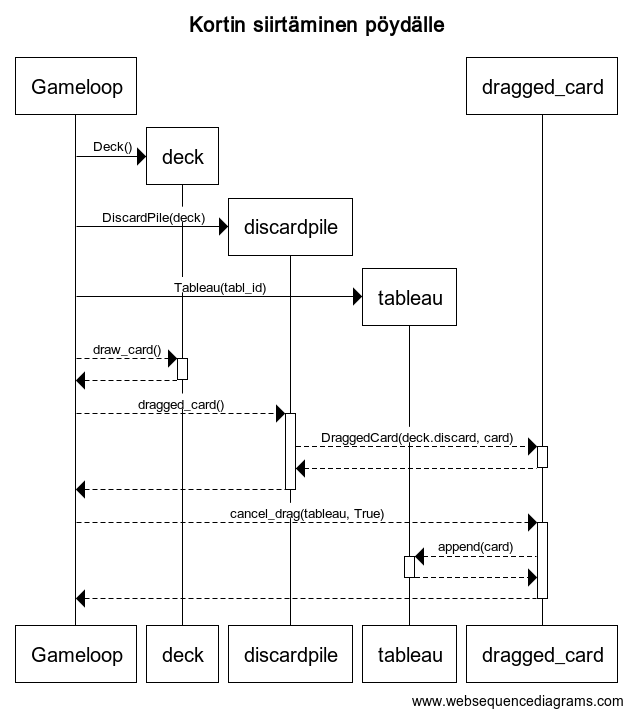

# Arkkitehtuurikuvaus

## Rakenne

Sovellus koostuu [interface](../src/interface/)-hakemistosta, jossa on käyttöliittymään liittyvät luokat, [deck](../src/deck/)-hakemistosta, jossa on sovelluslogiikan kannalta tärkeät luokat ja [data](../src/data/)-hakemistosta, jossa on tietokantaoperaatioihin liittyvät luokat, sekä tallennettu tietokanta. 

## Sovelluslogiikka

Sovelluksen logiikka koostuu kortteja, korttipakkaa ja pelimatolla olevia pinoja mallintavat luokat:
- [Card](../src/deck/card.py), joka mallintaa kortteja.
- [Deck](../src/deck/deck.py), joka mallintaa korttipakkaa.
- [Discardpile](../src/deck/discardpile.py), joka mallintaa hylkypinoa.
- [Drawpile](../src/deck/drawpile.py), joka mallintaa nostopinoa.
- [Tableau](../src/deck/tableau.py), joka mallintaa pelipinoja.
- [Endpile](../src/deck/endpile.py), joka mallintaa loppupinoja.
- [Draggedcard](../src/deck/draggedcard.py), joka mallintaa tällä hetkellä valittua korttia/kortteja.

Alla olevassa kuvassa näkyy karkeasti luokkien yhteydet. Käytännössä luokka [Gameloop](../src/deck/gameloop.py) hoitaa eri luokkien väliset interaktiot, esimerkiksi korttien siirron ja siirtojen laillisuuden tarkistamisen.

