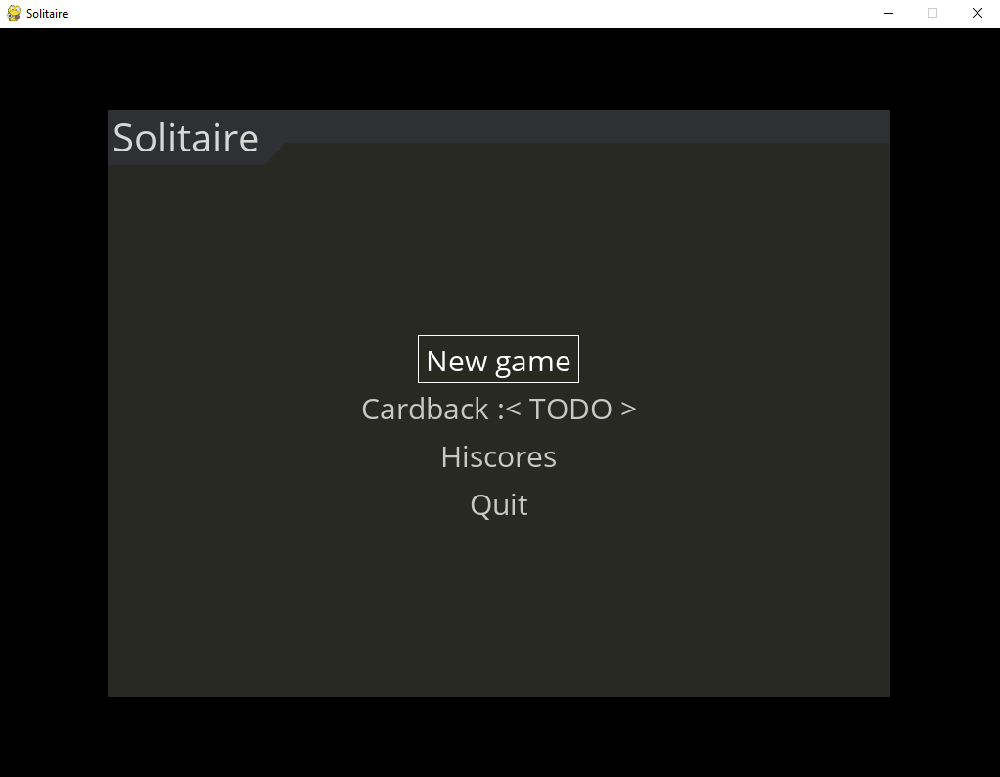
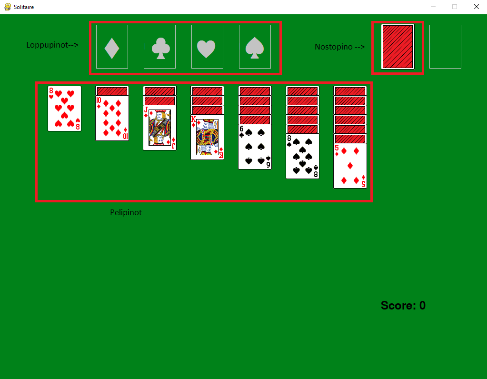

# Käyttöohje

## Alkuvalikko

Sovellus käynnistyy alkumenuun:

Menun navigointi tapahtuu joko hiirellä tai nuolinäppäimillä ja enterillä.

Uuden pelin voi aloittaa valitsemalla New game -painikkeen.

Cardback -valikosta voi vaihtaa korttien selkäkuvaa.

Hiscores -painikkeesta pääsee katsomaan parhaat tulokset.

Quit -painike poistuu pelistä.

## Pelin pelaaminen

Pelimatto on seuraavanlainen:

Nostopinoa painamalla pinosta nostetaan kortti vieressä olevaan tilaan.

Nostopinosta nostetun kortin voi mahdollisesti siirtää johonkin pelipinoon.

Kortteja voi myös siirrellä pelipinojen välillä joko yhden tai useamman kerrallaan.

Korttien siirtely tapahtuu kortteja klikkaamalla, ja viemällä kortti haluttuun sijaintiin.

Kortin raahaamisen voi perua hiiren oikealla painikkeella.

Pelin päämäärä lyhykäisyydessään on siirtää kaikki kortit ylhäällä oleviin loppupinoihin ässästä kuninkaaseen.

Tarkemmat pelisäännöt löytyvät [täältä](https://www.pasianssit.net/saannot.php) kohdasta "Klondiken säännöt".
