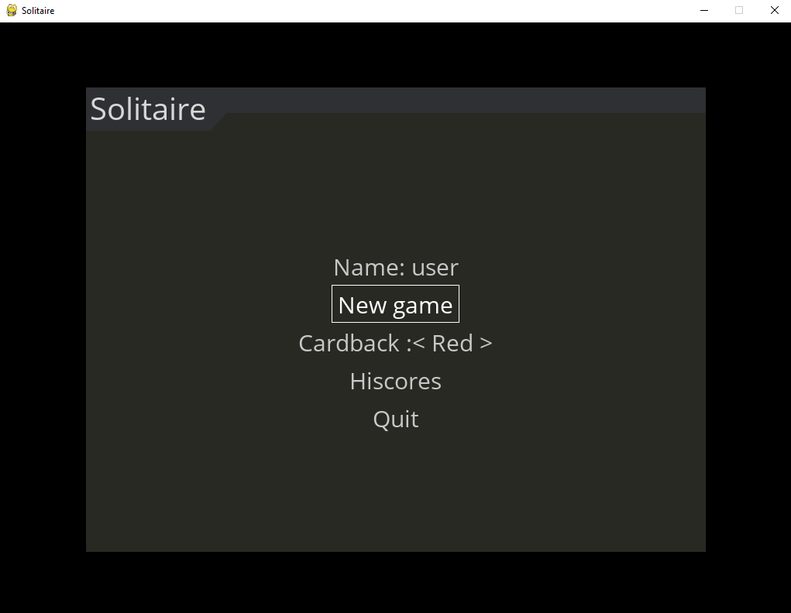

# Käyttöohje

Lataa ohjelman viimeisimmän [version](https://github.com/mikeessi/ot--harjoitustyo/releases) lähdekoodi painamalla _Assets_-osion alta _Source code_.

## Ohjelman käynnistäminen

## Asennus

1. Siirry kansioon `/otm-harjoitustyo`

2. Asenna riippuvuudet komennolla:

```bash
poetry install
```

3. Käynnistä sovellus komennolla:

```bash
poetry run invoke start
```

## Alkuvalikko

Sovellus käynnistyy alkumenuun:



Menun navigointi tapahtuu joko hiirellä tai nuolinäppäimillä ja enterillä.

Name-ruutuun voi kirjoittaa halutun nimen. Nimi voi olla maksimissaan 8 merkkiä pitkä, ja se voi sisältää ainoastaan pieniä ja isoja kirjaimia. Ruudun voi myös jättää tyhjäksi, mutta silloin ei saa omaa nimeä näkyviin hiscoreihin.

Uuden pelin voi aloittaa valitsemalla New game -painikkeen.

Cardback -valikosta voi vaihtaa korttien selkäkuvaa.

Hiscores -painikkeesta pääsee katsomaan parhaat tulokset.

Quit -painike poistuu pelistä.

## Pelin pelaaminen

Pelimatto on seuraavanlainen:


Nostopinoa painamalla pinosta nostetaan kortti vieressä olevaan tilaan.

Nostopinosta nostetun kortin voi mahdollisesti siirtää johonkin pelipinoon.

Kortteja voi myös siirrellä pelipinojen välillä joko yhden tai useamman kerrallaan.

Korttien siirtely tapahtuu kortteja klikkaamalla, ja viemällä kortti haluttuun sijaintiin.

Jotta kortin siirtäminen onnistuu, täytyy kortin vasemman yläkulman olla halutun pinon päällä.

Kortin raahaamisen voi perua hiiren oikealla painikkeella.

Pelin päämäärä lyhykäisyydessään on siirtää kaikki kortit ylhäällä oleviin loppupinoihin ässästä kuninkaaseen.

Tarkemmat pelisäännöt löytyvät [täältä](https://www.pasianssit.net/saannot.php) kohdasta "Klondiken säännöt".
