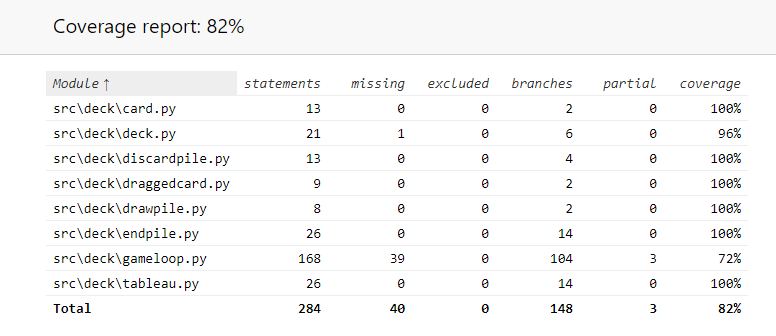

# Testausdokumentti

Ohjelmaa on testattu unittestin avulla sekä yksikkötestein, että integraatiotestein. Ohjelmaa on myös testattu manuaalisesti järjestelmätasolla.

## Yksikkö- ja integraatiotestaus

### Sovelluslogiikka

Sovelluslogiikasta vastaavat luokat hakemistossa [deck](../src/deck/) on testattu niitä vastaavilla [testiluokilla](../src/tests/). Jokainen sovelluslogiikkaa vastaava testiluokka testaa luokkaa yksikkötestein, paitsi [TestGameLoop](../src/tests/gameloop_test.py), jossa on myös integraatiotestejä.

### Testauskattavuus

Sovelluslogiikan testien haarautumakattavuus on 82%

Käytännössä ainoa asia, mitä sovelluslogiikan luokista ei testattu, on GameLoop-luokan tapahtumankäsittelijät, mutta tämän olisi varmaankin voinut välttää pitämällä tapahtumankäsittelijän erillään kaikesta muusta. 

### Järjestelmätestaus

Sovellusta on myös järjestelmätestatu manuaalisesti.

